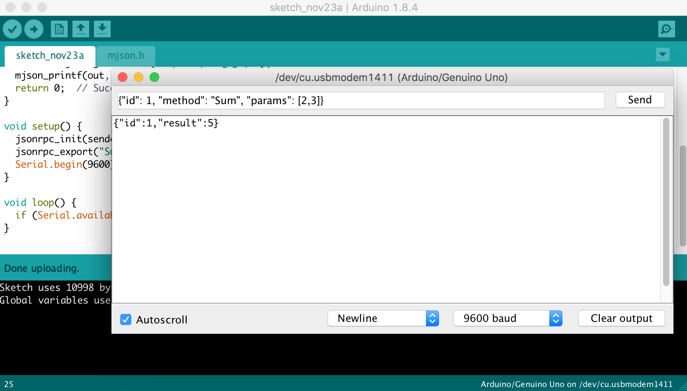

# mjson - a JSON parser + emitter + JSON-RPC engine

[](https://travis-ci.org/cesanta/mjson)
[](https://opensource.org/licenses/MIT)
[](https://codecov.io/gh/cesanta/mjson)

# Features

- Tiny footprint, single-file ISO C / ISO C++ library
- State machine parser, no allocations, no recursion
- High level API - fetch from JSON directly into C/C++ by
    [jsonpath](https://github.com/json-path/JsonPath)
- Low level SAX API
- Flexible JSON generation API - print to buffer, file, socket, etc

# Build options

- `-D MJSON_ENABLE_PRINT=0` disable emitting functionality, default: enabled
- `-D MJSON_IMPLEMENT_STRTOD=1` use own `strtod()`, default: stdlib is used
- `-D MJSON_MAX_DEPTH=30` define max object depth, default: 20
- `-D MJSON_ENABLE_BASE64=0` disable base64 parsing/printing, default: enabled
- `-D MJSON_ENABLE_RPC=0` disable RPC functionality, default: enabled
- `-D MJSON_RPC_IN_BUF_SIZE=4096` sets JSON-RPC input buffer size, default: 256

# Parsing API

## mjson_find()

```c
enum mjson_tok mjson_find(const char *s, int len, const char *path,
                          const char **tokptr, int *toklen);
```

In a JSON string `s`, `len`, find an element by its JSONPATH `path`.
Save found element in `tokptr`, `toklen`.
If not found, return `JSON_TOK_INVALID`. If found, return one of:
`MJSON_TOK_STRING`, `MJSON_TOK_NUMBER`, `MJSON_TOK_TRUE`, `MJSON_TOK_FALSE`,
`MJSON_TOK_NULL`, `MJSON_TOK_ARRAY`, `MJSON_TOK_OBJECT`. Example:

```c
// s, len is a JSON string: {"foo": { "bar": [ 1, 2, 3] }, "baz": true} 
char *p;
int n;
assert(mjson_find(s, len, "$.foo.bar[1]", &p, &n) == MJSON_TOK_NUMBER);
assert(mjson_find(s, len, "$.baz", &p, &n) == MJSON_TOK_TRUE);
assert(mjson_find(s, len, "$", &p, &n) == MJSON_TOK_OBJECT);
```

## mjson_get_number()

```c
double mjson_get_number(const char *s, int len, const char *path, double default_val);
```

In a JSON string `s`, `len`, return a number value by its JSONPATH `path`.
If not found, return `default_val`. Example:

```c
// s, len is a JSON string: {"foo": { "bar": [ 1, 2, 3] }, "baz": true} 
double v = mjson_get_number(s, len, "$.foo.bar[1]", 0);  // Assigns to 2
```

## mjson_get_bool()

```c
int mjson_get_bool(const char *s, int len, const char *path, int default_val);
```

In a JSON string `s`, `len`, return a value of a boolean by its JSONPATH `path`.
If not found, return `default_val`. Example:

```c
// s, len is a JSON string: {"foo": { "bar": [ 1, 2, 3] }, "baz": true} 
bool v = mjson_get_bool(s, len, "$.baz", false);   // Assigns to true
```

## mjson_get_string()

```c
int mjson_get_string(const char *s, int len, const char *path, char *to, int sz);
```
In a JSON string `s`, `len`, find a string by its JSONPATH `path` and unescape
it into a buffer `to`, `sz` with terminating `\0`.
If a string is not found, return 0.
If a string is found, return the length of unescaped string. Example:

```c
// s, len is a JSON string [ "abc", "de\r\n" ]
char buf[100];
int n = mjson_get_string(s, len, "$[1]", buf, sizeof(buf));  // Assigns to 4
```

## mjson_get_base64()

```c
int mjson_get_base64(const char *s, int len, const char *path, char *to, int sz);
```

In a JSON string `s`, `len`, find a string by its JSONPATH `path` and
base64 decode it into a buffer `to`, `sz` with terminating `\0`.
If a string is not found, return 0.
If a string is found, return the length of decoded string. Example:

```c
// s, len is a JSON string [ "MA==" ]
char buf[100];
int n = mjson_get_base64(s, len, "$[0]", buf, sizeof(buf));  // Assigns to 1
```


## mjson()

```c
int mjson(const char *s, int len, mjson_cb_t cb, void *cbdata);
```

Parse JSON string `s`, `len`, calling callback `cb` for each token. This
is a low-level SAX API, intended for fancy stuff like pretty printing, etc.


# Emitting API


The emitting API is flexible and can print to anything: fixed buffer,
dynamic growing buffer, FILE *, network socket, etc etc. The printer function
gets the pointer to the buffer to print, and a user-specified data:

```c
typedef int (*mjson_print_fn_t)(const char *buf, int len, void *userdata);
```

mjson library defines the following built-in printer functions:

```c
struct mjson_fixedbuf {
  char *ptr;
  int size, len;
};
int mjson_print_fixed_buf(const char *ptr, int len, void *userdata);

int mjson_print_file(const char *ptr, int len, void *userdata);
int mjson_print_dynamic_buf(const char *ptr, int len, void *userdata);
```

If you want to print to something else, for example to a network socket,
define your own printing function. If you want to see usage examples
for the built-in printing functions, see `unit_test.c` file.

## msjon_printf()

```c
int mjson_vprintf(mjson_print_fn_t, void *, const char *fmt, va_list ap);
int mjson_printf(mjson_print_fn_t, void *, const char *fmt, ...);
```

Print using `printf()`-like format string. Supported specifiers are:

- `%Q` print quoted escaped string. Expect NUL-terminated `char *`
- `%.*Q` print quoted escaped string. Expect `int, char *`
- `%s` print string as is. Expect NUL-terminated `char *`
- `%.*s` print string as is. Expect `int, char *`
- `%g` print floating point number. Expect `double`
- `%d`/`%u` print signed/unsigned integer. Expect `int`
- `%ld`/`%lu` print signed/unsigned long integer. Expect `long`
- `%B` print `true` or `false`. Expect `int`
- `%V` print quoted base64-encoded string. Expect `int, char *`
- `%M` print using custom print function. Expect `int (*)(mjson_print_fn_t, void *, va_list *)`

The following example produces `{"a":1, "b":[1234]}` into the
dynamically-growing string `s`.
Note that the array is printed using a custom printer function:

```c
static int m_printer(mjson_print_fn_t fn, void *fndata, va_list *ap) {
  int value = va_arg(*ap, int);
  return mjson_printf(fn, fndata, "[%d]", value);
}

...
char *s = NULL;
mjson_printf(&mjson_print_dynamic_buf, &s, "{%Q:%d, %Q:%M}", "a", 1, "b", m_printer, 1234);
/* At this point `s` contains: {"a":1, "b":[1234]}  */
free(s);
```

# JSON-RPC API

For the example, see `unit_test.c :: test_rpc()` function.

## jsonrpc_init

```c
void jsonrpc_init( int (*response_cb)(char *, int, void *),
                  void *privdata);
```

Initialize JSON-RPC context. The `sender()` function must be provided
by the caller, and it is responsible to send the prepared JSON-RPC
reply to the remote side - to the UART, or socket, or whatever.
The `sender()` function receives the full frame to send, and the `privdata`
poitner.

The `response_cb()` function could be left NULL. If it is non-NULL, it will
be called for all received responses generated by the `jsonrpc_call()`.
The `response_cb()` function receives full response frame, and the `privdata`
pointer.

## jsonrpc_process

```c
jsonrpc_process(const char *frame, int frame_len, jsonrpc_sender_t fn, void *fdata);
```

Parse JSON-RPC frame contained in `frame`, and invoke a registered handler.

## jsonrpc_call

```c
jsonrpc_call(jsonrpc_sender_t fn, void *fdata, const char *fmt, ...)
```

Send JSON-RPC call frame. The format must create a valid frame.
If the `id` is specified in the frame, then it'll generate a response frame.
When a response frame gets received, a 


## jsonrpc_export

```c
#define jsonrpc_export(const char *name,
                       void (*handler)(struct jsonrpc_request *),
                       void *handler_data)
```

Export JSON-RPC function. A function gets called by `jsonrpc_ctx_process()`,
which parses an incoming frame and calls a registered handler.
A `handler()` receives `struct jsonrpc_request *`. It could use
`jsonrpc_return_error()` or `jsonrpc_return_success()` for returning the result.

## struct jsonrpc_request

```c
struct jsonrpc_request {
  const char *params;     // Points to the "params" in the request frame
  int params_len;         // Length of the "params"
  const char *id;         // Points to the "id" in the request frame
  int id_len;             // Length of the "id"
  mjson_print_fn_t fn;    // Printer function
  void *fndata;           // Printer function data
  void *userdata;         // Callback's user data as specified at export time
};
```

This structure gets passed to the method callback.

## jsonrpc_return_success

```c
void jsonrpc_return_success(struct jsonrpc_request *r, const char *result_fmt, ...);
```

Return result from the method handler. NOTE: if the request frame ID
is not specified, this function does nothing.

## jsonrpc_return_error

```c
void jsonrpc_return_error(struct jsonrpc_request *r, int code, const char *message_fmt, ...);
```

Return error from the method handler. NOTE: if the request frame ID
is not specified, this function does nothing.


## JSON-RPC example

In the following example, we initialize JSON-RPC context, and call
a couple of JSON-RPC methods: a built-in `rpc.list` method which lists
all registered methods, and our own `foo` method.

The `sender()` implementation just prints the reply to the standard output,
but in real life it should send a reply to the real remote peer - UART, socket,
or whatever else.

```c
#include "mjson.h"

// A custom RPC handler. Many handlers can be registered.
static void foo(struct jsonrpc_request *r) {
  double x = mjson_get_number(r->params, r->params_len, "$[1]", 0);
  jsonrpc_return_success(r, "{%Q:%g,%Q:%Q}", "x", x, "ud", r->userdata);
}

// Sender function receives a reply frame and must forward it to the peer.
static int sender(char *frame, int frame_len, void *privdata) {
  printf("%.*s\n", frame_len, frame); // Print the JSON-RPC reply to stdout
  return frame_len;
}

int main(void) {
  jsonrpc_init(NULL, NULL);

  // Call rpc.list
  char request1[] = "{\"id\": 1, \"method\": \"rpc.list\"}";
  jsonrpc_process(request1, strlen(request1), sender, NULL);

  // Call non-existent method
  char request2[] = "{\"id\": 1, \"method\": \"foo\"}";
  jsonrpc_process(request2, strlen(request2), sender, NULL);

  // Register our own function
  char request3[] = "{\"id\": 2, \"method\": \"foo\",\"params\":[0,1.23]}";
  jsonrpc_export("foo", foo, (void *) "hi");
  jsonrpc_process(request3, strlen(request3), sender, NULL);

  return 0;
}
```

## JSON-RPC Arduino example

```c
#include "mjson.h"  // Sketch -> Add file -> add mjson.h

// Gets called by the RPC engine to send a reply frame
static int sender(const char *frame, int frame_len, void *privdata) {
  return Serial.write(frame, frame_len);
}

// RPC handler for "Sum". Expect an array of two integers in "params"
static void sum(struct jsonrpc_request *r) {
  int a = mjson_get_number(r->params, r->params_len, "$[0]", 0);
  int b = mjson_get_number(r->params, r->params_len, "$[1]", 0);
  jsonrpc_return_success(r, "%d", a + b);
}

void setup() {
  jsonrpc_init(NULL, NULL);   // Initialise the library
  jsonrpc_export("Sum", sum, NULL);   // Export "Sum" function
  Serial.begin(115200);               // Setup serial port
}

void loop() {
  if (Serial.available() > 0) jsonrpc_process_byte(Serial.read(), sender, NULL);
}
```

When this sketch is compiled and flashed on an Arduino
board, start Arduino Serial Monitor, type
`{"id": 1, "method": "Sum", "params": [2,3]}` and hit enter. You should
see an answer frame:



# Example - connect Arduino Uno to AWS IoT device shadow

[](https://www.youtube.com/watch?v=od1rsIrvwrM)

See https://mongoose-os.com/ccm/ for more information.

# Contact

Questions? See https://mdash.net/home/company.html
